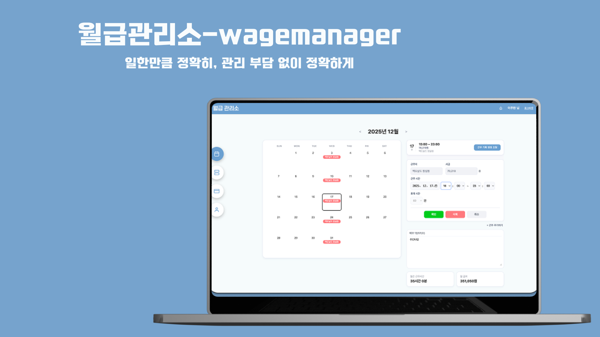

# WageManager

## 🎯 목표

단기 근로자와 소규모 자영업 고용주를 위한 투명하고 간편한 급여 관리 솔루션 제공

### 해결하고자 하는 문제
- 근무 기록 불투명성 및 수동 정산으로 인한 급여 체불/오류
- 근로자-고용주 간 신뢰 부족
- 고용주의 반복적인 급여 관리 업무 부담

### 기대 효과
- 실시간 근무 기록 공개를 통한 근로자 권익 보호
- 급여 계산/정산 반자동화로 고용주 관리 비용 절감
- 객관적 데이터 기반 정산으로 분쟁 감소 및 상호 신뢰 구축

## 💡 동기
최근 노동 시장은 단기 근로자 증가와 플랫폼 기반 긱 워커(Gig Worker) 확산으로 급변하고 있음. 하지만 기존의 경직된 급여 관리 시스템은 이러한 변화에 대응하지 못하고 있음.

수기로 근무 시간을 기록하고, 엑셀로 급여를 계산하고, 일일이 송금하는 과정에서 실수와 분쟁이 발생함. 근로자는 제대로 받았는지 불안하고, 고용주는 매번 반복되는 정산 업무에 지침.

**"일한 만큼 정확히, 관리 부담 없이 간편하게"** — 이 단순한 목표를 실현하기 위해 월급 관리소를 만들게 됨.

## 🔑 주요 기능

### 👔 고용주 (Employer)

| 기능 | 설명 |
|------|------|
| **📅 일일 스케줄 관리** | 날짜별 근무자 타임라인 조회 및 근무 시간 편집 |
| **👥 근로자 관리** | 근로자 등록/수정/퇴사 처리, 근무 스케줄 설정 |
| **🏢 근무지 관리** | 다중 근무지 생성/수정/삭제 |
| **💰 급여 정산** | 월별 급여 계산 및 송금 관리 |
| **📋 계약 관리** | 시급, 근무 스케줄, 공제 유형 설정 |

### 👷 근로자 (Worker)

| 기능 | 설명 |
|------|------|
| **📆 월간 캘린더** | 월별 근무 기록 조회 및 일자별 상세 확인 |
| **📊 주간 캘린더** | 주 단위 근무 스케줄 조회 |
| **✏️ 근무 정정 요청** | 잘못된 근무 기록 정정 요청 |
| **💵 급여 내역** | 월별 급여 및 입금 상태 확인 |
| **📝 메모** | 일자별 메모 작성 |

### 🔔 공통 기능

- **카카오 소셜 로그인** - 간편한 회원가입/로그인
- **실시간 알림** - 급여 정산, 정정 요청 등 알림

## 📌 기술 스택

| 분류 | 기술 |
|------|------|
| **Frontend** | React 19, Vite 7 |
| **상태관리** | Redux Toolkit, React-Redux |
| **라우팅** | React Router DOM v7 |
| **스타일링** | TailwindCSS, CSS |
| **HTTP 클라이언트** | Axios |
| **UI 컴포넌트** | React-Icons, SweetAlert2, React-Toastify |

## 👥 기여자

| 이름 | 담당 |
|------|------|
| **조용근** | PM & Backend |
| **김나현** | Design & Frontend |
| **이주한** | Frontend |
| **강소영** | Backend |
| **최영찬** | Backend |

## Visit our Notion Page and Get the App (available only in South Korea).
Notion: https://www.notion.so/GOAT-27b6550d6d4480019236d1a9d4c9ef54?source=copy_link

## 📁 프로젝트 구조

```
src/
├── main.jsx                 # 앱 엔트리 포인트
├── App.jsx                  # 라우팅 설정 및 메인 컴포넌트
├── index.css                # 전역 스타일
│
├── api/                     # API 통신 모듈
│   ├── authApi.js           # 인증 관련 API
│   ├── employerApi.js       # 고용주 API
│   ├── workerApi.js         # 근로자 API
│   ├── payrollApi.js        # 급여 API
│   ├── notificationApi.js   # 알림 API
│   └── httpClient.js        # HTTP 클라이언트 설정
│
├── components/              # 재사용 가능한 UI 컴포넌트
│   ├── common/              # 공통 컴포넌트 (Button, Card, Modal 등)
│   ├── layout/              # 레이아웃 컴포넌트 (Header, Nav)
│   ├── employer/            # 고용주 전용 컴포넌트
│   └── worker/              # 근로자 전용 컴포넌트
│
├── pages/                   # 페이지 컴포넌트
│   ├── auth/                # 인증 페이지 (로그인, 회원가입)
│   ├── employer/            # 고용주 페이지
│   │   ├── DailyCalendarPage.jsx      # 일일 스케줄 관리
│   │   ├── WorkerManagePage.jsx       # 근로자 관리
│   │   └── RemittanceManagePage.jsx   # 급여 정산
│   └── workers/             # 근로자 페이지
│       ├── WorkerMonthlyCalendarPage.jsx  # 월간 캘린더
│       ├── WorkerWeeklyCalendarPage.jsx   # 주간 캘린더
│       └── WorkerRemittancePage.jsx       # 급여 내역
│
├── features/                # Redux 슬라이스 (상태 관리)
│   ├── auth/                # 인증 상태
│   ├── employer/            # 고용주 상태
│   ├── worker/              # 근로자 상태
│   ├── payroll/             # 급여 상태
│   └── notification/        # 알림 상태
│
├── services/                # 비즈니스 로직 서비스
├── layouts/                 # 페이지 레이아웃
├── hooks/                   # 커스텀 훅
├── utils/                   # 유틸리티 함수
├── constants/               # 상수 정의
├── styles/                  # 스타일 파일 (CSS)
└── assets/                  # 정적 리소스 (이미지 등)
```

## 🚀 시작하기

### 1. 요구사항

- Node.js 18+
- npm 9+

### 2. 설치

```bash
# 저장소 클론
git clone https://github.com/your-org/wagemanager-frontend.git
cd wagemanager-frontend

# 의존성 설치
npm install

# 환경 변수 설정
cp .env.example .env
```

### 주요 의존성

**Dependencies**
| 패키지 | 버전 | 설명 |
|--------|------|------|
| react | ^19.2.0 | UI 라이브러리 |
| react-dom | ^19.2.0 | React DOM 렌더링 |
| react-router-dom | ^7.9.6 | 클라이언트 사이드 라우팅 |
| @reduxjs/toolkit | ^2.11.0 | 상태 관리 |
| react-redux | ^9.2.0 | React-Redux 바인딩 |
| axios | ^1.13.2 | HTTP 클라이언트 |
| react-icons | ^5.5.0 | 아이콘 컴포넌트 |
| react-toastify | ^11.0.5 | 토스트 알림 |
| sweetalert2 | ^11.26.3 | 알림 다이얼로그 |

**DevDependencies**
| 패키지 | 버전 | 설명 |
|--------|------|------|
| vite | ^7.2.2 | 빌드 도구 |
| tailwindcss | ^4.1.17 | CSS 프레임워크 |
| eslint | ^9.39.1 | 코드 린터 |
| @vitejs/plugin-react | ^5.1.0 | Vite React 플러그인 |

### 3. 실행

```bash
# 개발 서버 실행
npm run dev

# 빌드
npm run build

# 린트 검사
npm run lint
```

## 🧑‍💻 기여 방법

1. **이 저장소를 Fork 합니다**
   ```bash
   https://github.com/WageManager/WageManager-frontend.git
   ```
2. **새 브랜치를 생성합니다**
   ```bash
   git checkout -b feature/your-new-feature-name
   ```

3. **변경 사항을 커밋합니다**
   ```bash
   git commit -m "feat: add your-change-logs"
   ```

4. **브랜치를 Push 합니다**
   ```bash
   git push your-remote-name feature/your-new-feature-name
   ```

5. **GitHub에서 Pull Request를 생성합니다**

## 📄 License

MIT License
